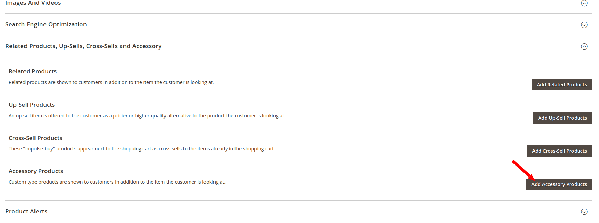

# Mageplugins_RelatedProducts

## Overview

`Mageplugins_RelatedProducts` is a Magento 2 extension designed to enhance the functionality of related products. This module provides an advanced system to link accessory products with main products, making it easier for customers to find and purchase complementary items.

## Features

- **Advanced Accessory Linking:** Allows you to link accessory products with main products seamlessly.
- **Custom Display Options:** Customize how related products are displayed on the product page.
- **Enhanced User Experience:** Improved UI/UX for customers to easily find and add related accessories to their cart.

## Installation

### Option 1: Manual Installation

1. Create the necessary directory structure inside your Magento `code` directory:

    ```bash
    mkdir -p app/code/Mageplugins
    ```

2. Clone the extension into this directory:

    ```bash
    git clone https://github.com/ccyogendra/accessory-products.git
    ```

3. Rename the cloned folder:

    ```bash
    mv app/code/Mageplugins/accessory-products app/code/Mageplugins/RelatedProducts
    ```
Or Manually   
Directory rename folder accessory-products to RelatedProducts

# Enable the Module
```Bash
php bin/magento module:enable Mageplugins_RelatedProducts
php bin/magento setup:upgrade
```


# Clear Cache
```Bash
php bin/magento cache:clean
php bin/magento cache:flush
```

## Login as Admin
Add New Product You can see 'Add accessory product' button.


